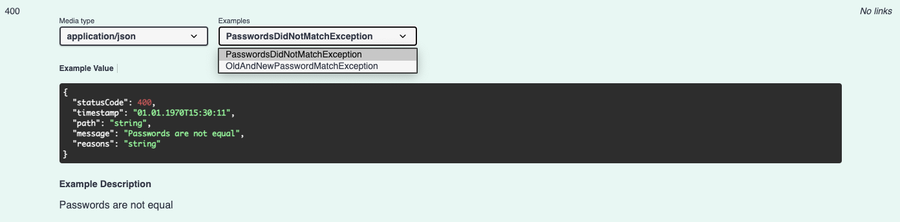
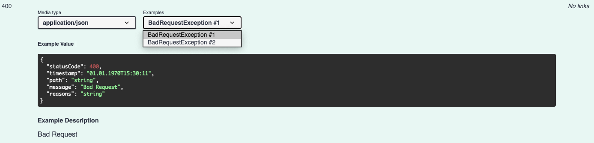

# nestjs-swagger-api-exception-decorator

https://www.npmjs.com/package/@nanogiants/nestjs-swagger-api-exception-decorator


NestJS Swagger decorator for specifying API exceptions. This is a wrapper for `@ApiResponse(...)` which uses `message` and `status` inside NestJS `HttpException` as description and HTTP status code in the Swagger documentation. You can pass any subclass of `HttpException` to the decorator. This decorator is especially useful if you want to define multiple custom exceptions per status code.

When using custom exceptions it's names will be used as example name in API documentation. If multiple exceptions with the same name exist, the exceptions with the same name will be consecutively numbered.

# Examples

## `@ApiException` decorator without any template

When using the decorator without specifying any template, only the description of the exception will be visible.


## `@TemplatedApiException` decorator with a template

When using the decorator built with the `buildTemplatedApiExceptionDecorator()` method you can specify any template which should be visible.


## Decorator with multiple exceptions per status code

When specifying multiple exceptions per status code, they will be visible as separated examples.



## Decorator with multiple exceptions per status code and same name

When specifying multiple exceptions per status code with the same name, they are visible as separate examples consecutively numbered.



# Installation

```bash
npm i @nanogiants/nestjs-swagger-api-exception-decorator
```

# Usage

TypeScript:

```typescript
import { ApiException } from '@nanogiants/nestjs-swagger-api-exception-decorator';
```

Assuming these custom exceptions:

```typescript
export class UserNotFoundException extends NotFoundException {
  constructor() {
    super('User not found');
  }
}

export class InvalidJwtException extends UnauthorizedException {
  constructor() {
    super('The JWT is invalid');
  }
}

export class CredentialsNotValidException extends UnauthorizedException {
  constructor() {
    super('Credentials not valid');
  }
}

export class PasswordsDidNotMatchException extends BadRequestException {
  constructor() {
    super('Passwords are not equal');
  }
}

export class OldAndNewPasswordMatchException extends BadRequestException {
  constructor() {
    super('New and old passwords should not match');
  }
}
```

## Without template

When using `@ApiException` decorator at class and method level is going to construct the endpoint
documentation with all specified exceptions. See _examples without template_.

```typescript
@ApiException(UserNotFoundException)
@ApiException(InvalidJwtException)
export class UserController {

  [...]

  @ApiOperation({ summary: 'Changes the users password' })
  @ApiOkResponse({ description: 'The password was changed successfully' })
  @ApiException([PasswordsDidNotMatchException, OldAndNewPasswordMatchException])
  @ApiException(CredentialsNotValidException)
  @Patch('/password')
  async changeUserPassword(@Res() res, ...): Promise<void> {
    return res.sendStatus(HttpStatus.OK);
  }
}
```

## With template

When using a exception filter, you may want to specify the template of response body in your exception examples.

Build your own templated `@ApiException` decorator like this:

```typescript
import { buildTemplatedApiExceptionDecorator } from '@nanogiants/nestjs-swagger-api-exception-decorator';

export const TemplatedApiException = buildTemplatedApiExceptionDecorator({
  statusCode: '$status',
  timestamp: '01.01.1970T15:30:11',
  path: 'string',
  message: '$description',
  reasons: 'string',
});
```

And use your custom decorator:

```typescript
@TemplatedApiException(UserNotFoundException)
@TemplatedApiException(InvalidJwtException)
export class UserController {

  [...]

  @ApiOperation({ summary: 'Changes the users password' })
  @ApiOkResponse({ description: 'The password was changed successfully' })
  @TemplatedApiException([PasswordsDidNotMatchException, OldAndNewPasswordMatchException])
  @TemplatedApiException(CredentialsNotValidException)
  @Patch('/password')
  async changeUserPassword(@Res() res, ...): Promise<void> {
    return res.sendStatus(HttpStatus.OK);
  }
}
```

This constructs the same as using the decorator directly but with a specified template. See _examples with template_.

You may use the available placeholders:

- `$status`: replaces the placeholder by the status code specified in the exception
- `$description`: replaces the placeholder by the message/description specified in the exception

### `(template: any, options?: Options)` Description

* `template`: pass any template object (may include any placeholder as previously described)
* `options`
  * `template`: Specify template here. Specifying template here again, overwrites globally set template. DEFAULT: `undefined`
  * `contentType`: Specify content type. DEFAULT: `application/json`

## At class level

When applying the default or templated decorator at class level, it will only be applied to all class methods which are decorated by the `@ApiOperation` decorator.

# License

```
The MIT License (MIT)

Copyright 2020 NanoGiants GmbH

Permission is hereby granted, free of charge, to any person obtaining a copy of this software and
associated documentation files (the "Software"), to deal in the Software without restriction,
including without limitation the rights to use, copy, modify, merge, publish, distribute, sublicense,
and/or sell copies of the Software, and to permit persons to whom the Software is furnished to do so,
subject to the following conditions:

The above copyright notice and this permission notice shall be included in all copies or substantial
portions of the Software.

THE SOFTWARE IS PROVIDED "AS IS", WITHOUT WARRANTY OF ANY KIND, EXPRESS OR IMPLIED, INCLUDING BUT NOT
LIMITED TO THE WARRANTIES OF MERCHANTABILITY, FITNESS FOR A PARTICULAR PURPOSE AND
NONINFRINGEMENT. IN NO EVENT SHALL THE AUTHORS OR COPYRIGHT HOLDERS BE LIABLE FOR ANY CLAIM,
DAMAGES OR OTHER LIABILITY, WHETHER IN AN ACTION OF CONTRACT, TORT OR OTHERWISE, ARISING FROM, OUT
OF OR IN CONNECTION WITH THE SOFTWARE OR THE USE OR OTHER DEALINGS IN THE SOFTWARE.
```
