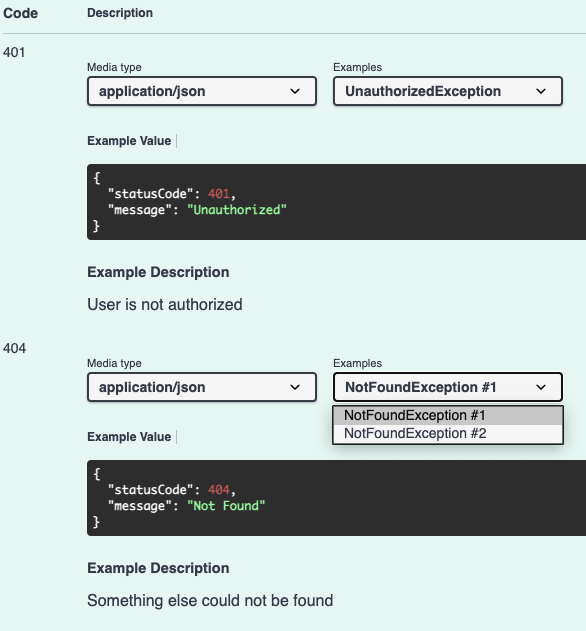

When specifying multiple exceptions with the same name, all exceptions will be consecutively numbered:

```typescript
import { ApiException } from '@nanogiants/nestjs-swagger-api-exception-decorator';

@Controller()
@ApiException(() => UnauthorizedException, { description: 'User is not authorized' })
export class AppController {
  @Patch()
  @ApiOperation({ summary: 'This is an example with nestjs default exceptions' })
  @ApiException(() => NotFoundException, { description: 'Resource could not be found' })
  @ApiException(() => NotFoundException, { description: 'Something else could not be found' })
  updateResource() {
    return 'resource has been updated';
  }
}
```


