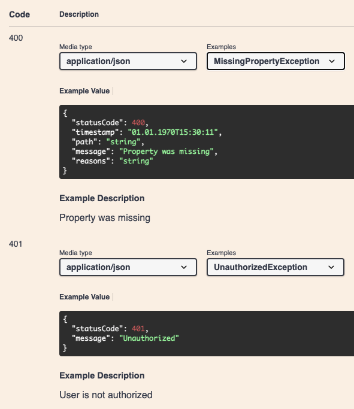

When using the [templated decorator](/gettingstarted/usage/templated#use-the-builder-function) you can specify your own template to match the response body of your [NestJS exception](https://docs.nestjs.com/exception-filters) filters:

```typescript
@Controller()
@ApiException(() => UnauthorizedException, { description: 'User is not authorized' })
export class AppController {
  @Post()
  @ApiOperation({ summary: 'This is an example with custom named exceptions' })
  @TemplatedApiException(() => [MissingPropertyException, PayloadMissingException])
  createResource() {
    return 'resource has been created';
  }
}
```


